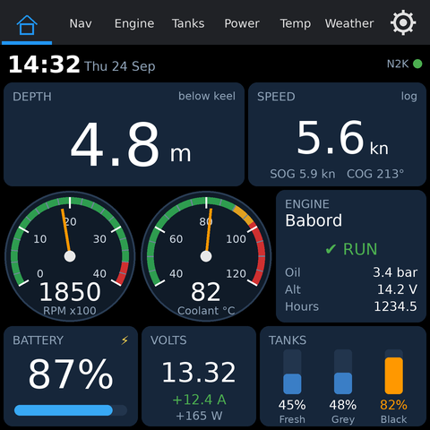
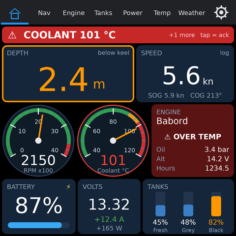
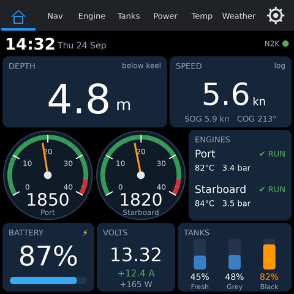
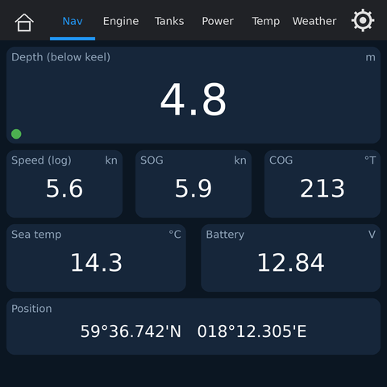
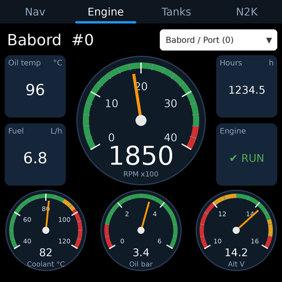
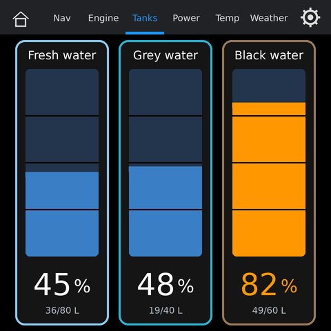
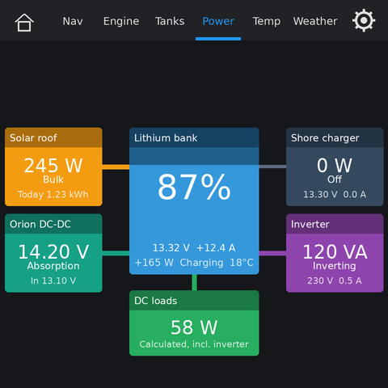
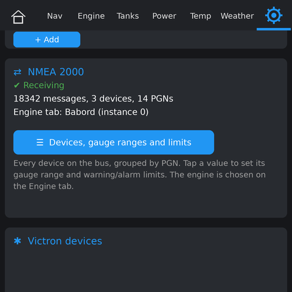
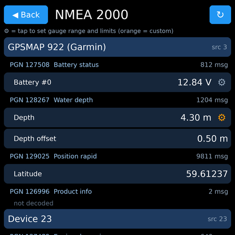
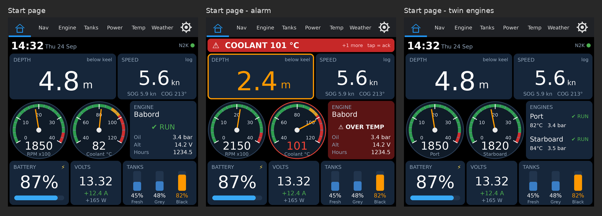

# esp32-S3-ws4-boat

Boat display for the **Waveshare ESP32-S3-Touch-LCD-4 (V4)**, the 480×480 touch board with
the CH32V003 IO expander and an on-board CAN transceiver. Built with Arduino and LVGL 8.

It shows **NMEA 2000** data from the boat's backbone (depth, speed, sea temperature, position,
engine, tanks) together with **Victron** and **RuuviTag** Bluetooth sensors and **weather**,
and logs to an **SD card**.

Derived from [esp32-S3-ws4-caravan](https://github.com/fredrikrudin/esp32-S3-ws4-caravan);
the relay board, Shelly and battery-BMS parts were removed, NMEA 2000 was added.

> **Status: first build.** The NMEA 2000 part has not been tested on hardware yet.
> The pictures in `screens/` are mockups rendered from the layouts, not photos
> (the Power tab is the caravan project's picture with the boat tab bar).


<p>



</p>
<p>



</p>
<p>



</p>

## Tabs

| Tab | What it shows |
|---|---|
| **⌂ Home** | [Start page](#start-page): time and date, depth and speed, RPM and coolant (or port and starboard RPM with twin engines), engine status, battery SOC and volts, tanks. Warnings and alarms take over the top line |
| **Nav** | Depth (with transducer offset), log speed, SOG, COG, sea temperature, battery volts, position - NMEA 2000 |
| **Engine** | Tachometer, coolant / oil pressure / alternator gauges with coloured zones, oil temp, fuel rate, hours, engine alarms - NMEA 2000. The dropdown chooses which engine this display shows |
| **Tanks** | One vertical gauge per tank (fresh, grey, black water, fuel ...) in %, litres when the sender reports capacity - NMEA 2000 |
| **Power** | Victron devices over Bluetooth (Instant Readout) with animated energy flows; tap a tile for 24 h / 7 day history |
| **Temp** | Up to 3 named RuuviTags: temperature, humidity, pressure, battery |
| **Weather** | NTP clock, current weather and a 3-day forecast from Open-Meteo (no API key) |
| **⚙ Settings** | WiFi, web page, weather location, RuuviTags, **NMEA 2000**, Victron, display, scan interval, SD card |

**Settings → NMEA 2000 → Devices, gauge ranges and limits** opens a list of every device on
the bus, grouped by the PGNs it sends, with the decoded values. Tap a value to set its gauge
range and warning/alarm limits. They are used by all tabs and the web page right away.

After 30 seconds without touch, a screen saver shows a dim clock and the battery state of
charge, and lowers the backlight - **except while the Engine tab is shown or an alarm is
not yet acknowledged**
(`ENG_KEEP_AWAKE` in `n2k_config.h`). A tap wakes it.

All settings are saved in flash and survive restarts.

## Start page



| Area | Content |
|---|---|
| Top line | Time and date, and an "N2K" dot (green while NMEA 2000 data arrives). Becomes the alarm banner |
| Depth | Large, with the sounder's offset applied; says whether it is below keel, surface or transducer |
| Speed | Speed through water (log); speed over ground and course underneath. Without a log: SOG |
| Middle | RPM and coolant dials + engine card (name, RUN / STOP / fault, oil pressure, alternator, hours) |
| Battery | State of charge with bar and a charging symbol (Victron battery monitor) |
| Volts | Battery voltage with current and watts (Victron, or the NMEA 2000 battery status when there is no Victron) |
| Tanks | The first four tanks as small bars in %, coloured by their limits |

### Warnings and alarms
Every value with limits (depth, RPM, coolant, oil pressure, alternator, battery volts, tanks)
and the engine's own fault flags are checked twice a second, plus battery SOC (warning below
20 %, alarm below 10 %).

- The top line becomes a banner with the most important message: **orange** for a warning,
  **red and blinking** for an alarm, "+N more" when there are several.
- The card of that value gets an orange or red outline and its value changes colour; an
  engine fault turns the whole engine card red.
- A new alarm wakes the screen saver, keeps the screen on, switches to the start page (not
  when the Engine tab is shown, which displays it too) and is written to the log.
- Tap the banner to acknowledge: it stops blinking and the screen may sleep again, but it
  stays until the value is back in range.
- Tank levels only reach the banner at alarm level; tank warnings just colour the tank.
- Low oil pressure and low alternator voltage only count while the engine runs.

The limits are set per value under **Settings → NMEA 2000 → Devices, gauge ranges and limits**.
The SOC limits and the number of tanks shown are `START_SOC_WARN`, `START_SOC_ALARM` and
`START_TANKS` at the top of `ui_home.cpp`.

### Twin engines


**Settings → NMEA 2000 → Twin engines** switches the start page to two RPM dials:

- **Port** (N2K engine instance 0) on the left, **Starboard** (instance 1) on the right, with
  the engine's name on each dial. Each dial uses its own engine's limits.
- The coolant dial is hidden. The engine card becomes **ENGINES** with a block per engine:
  name and RUN / STOP / FAULT, then coolant temperature and oil pressure, coloured by their
  limits.
- Alarms carry the engine name, e.g. "PORT COOLANT 101 °C" or "STARBOARD LOW OIL PRESSURE";
  a fault on either engine turns the card red.
- The names default to "Port" and "Starboard". Change them with the web API keys
  `port_name` / `stbd_name`, e.g. to "Babord" and "Styrbord"; `twin_engines` = 0/1 switches
  the mode. The instances are `ENG_PORT_INSTANCE` / `ENG_STBD_INSTANCE` in `n2k_config.h`.
- The setting and the names are included in the settings backup.

The **Engine tab** always shows one engine in detail: **Babord / Port (instance 0)**,
**Styrbord / Stbd (instance 1)** or a single engine, chosen in its dropdown. With two
displays, set one to each engine. See [N2K_INTEGRATION.md](N2K_INTEGRATION.md) if both
engine gateways report instance 0.

## Web page

Open **`http://boat.local/`** (or the board's IP, shown under Settings → WiFi) on the same
WiFi. It shows depth, speed, sea temperature, engine and tanks, the battery and solar
gauges, temperatures, weather and the Victron devices, and refreshes every 5 seconds.

| Path | |
|---|---|
| `/json` | Summary as JSON (battery, Victron, temperatures, weather, boat) |
| `/api/n2k` | All NMEA 2000 data: devices → PGNs → values with limits |
| `/api/n2k/set` | POST: engine, tank names, gauge ranges and limits (see [N2K_INTEGRATION.md](N2K_INTEGRATION.md)) |
| `/log` | Recent log lines |
| `/files` | Files on the SD card, for download |

Under **Settings → Web page** you can name the page and set a password; scripts can then use
`?key=<password>`. The page uses plain HTTP, so the password keeps casual visitors out but is
not strong security.

## Getting started

1. Install the libraries and set the Arduino IDE options below.
2. Open `esp32-S3-ws4-boat.ino` and upload.
3. On the board, open **⚙ Settings**: WiFi, weather location, RuuviTags, Victron devices
   (name + 32-character encryption key from VictronConnect → Product info).
4. Connect the CAN terminal to the NMEA 2000 backbone (see Hardware notes) and check
   **Settings → NMEA 2000**: it should say *Receiving* and list your devices.
5. Choose the engine on the Engine tab.

Tip: `tools/n2k_bus_test/n2k_bus_test.ino` is a standalone sketch (no display) that prints
every PGN and decoded value to the Serial Monitor - useful for a first wiring test.

## Libraries

- **lvgl 8.x**, with the `lv_conf.h` from Waveshare's examples (the gauges use `lv_meter`,
  which LVGL 9 no longer has)
- **GFX Library for Arduino**, **SensorLib** and **WS_CH32_IO**: the versions bundled with
  Waveshare's ESP32-S3-Touch-LCD-4 examples
  ([waveshareteam/ESP32-S3-Touch-LCD-4](https://github.com/waveshareteam/ESP32-S3-Touch-LCD-4), `examples/arduino/libraries`)
- **ArduinoJson** v7
- **NimBLE-Arduino** by h2zero, v2.x
- **NMEA2000** by Timo Lappalainen ([GitHub](https://github.com/ttlappalainen/NMEA2000), Library Manager: "NMEA2000-library")
- **NMEA2000_esp32_twai** by Sergei Podshivalov ([GitHub](https://github.com/sergei/NMEA2000_esp32_twai), install as ZIP;
  the older `NMEA2000_esp32` does not build for the ESP32-S3)

## Arduino IDE settings

- Board: ESP32S3 Dev Module
- **PSRAM: OPI PSRAM** (display framebuffer and LVGL buffers live there)
- **Erase All Flash Before Sketch Upload: Disabled**, otherwise every upload wipes the saved settings

In `lv_conf.h`:

- Enable `LV_FONT_MONTSERRAT_14`, `_20`, `_28`, `_32` and `_48` for the gauges, the big clock and temperatures
  (missing sizes fall back to smaller fonts)
- `LV_USE_METER 1` (default in LVGL 8)
- To free internal RAM, move LVGL's memory pool to PSRAM:
  ```c
  #define LV_MEM_POOL_INCLUDE <esp32-hal-psram.h>
  #define LV_MEM_POOL_ALLOC ps_malloc
  ```

## Logging

Diagnostics go to the Serial Monitor (115200) and to a buffer readable at `/log`.
**Settings → SD card** also writes them to `/boat.log` on the TF card
(SDMMC 1-bit: GPIO2 clock, GPIO1 command, GPIO4 data).

**Measurements as CSV:** "Log measurements" appends a line to `/data.csv` every 1, 5, 15 or
60 minutes: time, SOC, battery, solar, RuuviTag and outside temperatures, then the NMEA 2000
values (depth, speed, SOG, COG, sea temp, position, engine and tank levels).

**Settings backup:** "Back up settings" writes everything to `/settings.json`, including WiFi,
Victron keys and the NMEA 2000 engine choice, tank names and limits. "Restore" reads it back
and restarts.

## Configuration

`n2k_config.h`: CAN pins, listen-only mode, default engine, tank list, first-boot gauge ranges
and limits, screensaver behaviour on the Engine tab. `app.h`: web page name (`MDNS_NAME`),
screen saver timeout and the other general settings.

## Files

Flat folder: `app.h` holds shared configuration, types and declarations; each `.cpp` is one module.

| File | Contents |
|---|---|
| `esp32-S3-ws4-boat.ino` | `setup()` and `loop()` |
| `app.h`, `state.cpp` | Shared declarations, state, settings loading |
| `board.cpp` | Display, touch, IO expander, LVGL driver, backlight |
| `net.cpp` | Network task: WiFi, NTP, weather, all flash writes |
| `web.cpp` | Web page, `/json`, `/api/n2k` |
| `ble.cpp`, `ruuvi.cpp`, `victron.cpp` | Bluetooth scanning, RuuviTag and Victron decoding |
| `sdlog.cpp`, `datalog.cpp` | Log, CSV measurements, settings backup |
| `history.cpp`, `ui_history.cpp` | Energy history behind the Power tab |
| `n2k_config.h` | NMEA 2000 configuration |
| `n2k_bus.*`, `n2k_data.*`, `n2k_limits.*`, `n2k_settings.*`, `n2k_web.cpp` | NMEA 2000: CAN, value store, limits, settings, JSON |
| `ui_common.cpp` | Tabs, keyboard, widget helpers, timers |
| `ui_home.cpp` | Start page, warnings and alarms, twin-engine layout |
| `ui_power.cpp`, `ui_temp.cpp`, `ui_weather.cpp` | Power, Temp and Weather tabs |
| `ui_nav.*`, `ui_engine.*`, `ui_tanks.*` | Nav, Engine and Tanks tabs |
| `ui_n2k_settings.*` | NMEA 2000 device/PGN browser and limit editor |
| `ui_gauge.*`, `ui_n2k_common.*` | Analog gauge widget, shared tiles and colours |
| `ui_settings.cpp`, `ui_victron_settings.cpp` | Settings tab |
| `ui_saver.cpp`, `font_clock_96.c` | Screen saver and its 96 px clock font |
| `N2K_INTEGRATION.md` | How the NMEA 2000 part works, web API, limits |
| `memory.md` | Notes on internal RAM use |
| `tools/n2k_bus_test/` | Standalone NMEA 2000 bus test sketch |

## Hardware notes

- **CAN / NMEA 2000:** TX = GPIO6, RX = GPIO0 (Waveshare V4.0 hardware reference).
  NET-H → CAN-H, NET-L → CAN-L, common ground with the boat's 12 V. Do **not** switch on the
  board's 120 Ω termination: an N2K backbone is already terminated. The display only listens
  by default (`N2K_LISTEN_ONLY`).
- **Backlight** PWM comes from the CH32V003 and is inverted (0 = full, 255 = off); handled in `set_backlight()`.
- **I2C** (touch, CH32V003, RTC) is on GPIO15/7.
- **Victron:** enable *Instant readout via Bluetooth* in VictronConnect and copy the encryption key from *Product info*.
- **Weather** uses plain HTTP: HTTPS needs more internal RAM than is free with WiFi, Bluetooth and the display running.
- LVGL's built-in fonts have no å/ä/ö: keep names ASCII unless a custom font is added.

## Troubleshooting

| Problem | Likely cause |
|---|---|
| Settings gone after an upload | *Erase All Flash Before Sketch Upload* is enabled |
| Settings → NMEA 2000 says "No NMEA 2000 data" | Wiring (CAN-H/L swapped?), no N2K power on the backbone, or ground missing |
| A device's name shows as "Device 23" | It announced itself before the display started; restart the device, or set `N2K_LISTEN_ONLY false` |
| Engine tab stays empty | Wrong instance chosen, or both gateways use instance 0 (use `engine_source`) |
| Weather or city lookup fails | Check `HTTP` and `Internal heap` lines in the Serial Monitor |
| Victron "Wrong key" / "No signal" | Key mistyped / out of range or Instant readout off |

## Credits

- [NMEA2000](https://github.com/ttlappalainen/NMEA2000) by Timo Lappalainen
- [NMEA2000_esp32_twai](https://github.com/sergei/NMEA2000_esp32_twai) by Sergei Podshivalov
- Engine screen inspired by [Marine-Displays](https://github.com/Boatingwiththebaileys/Marine-Displays)
