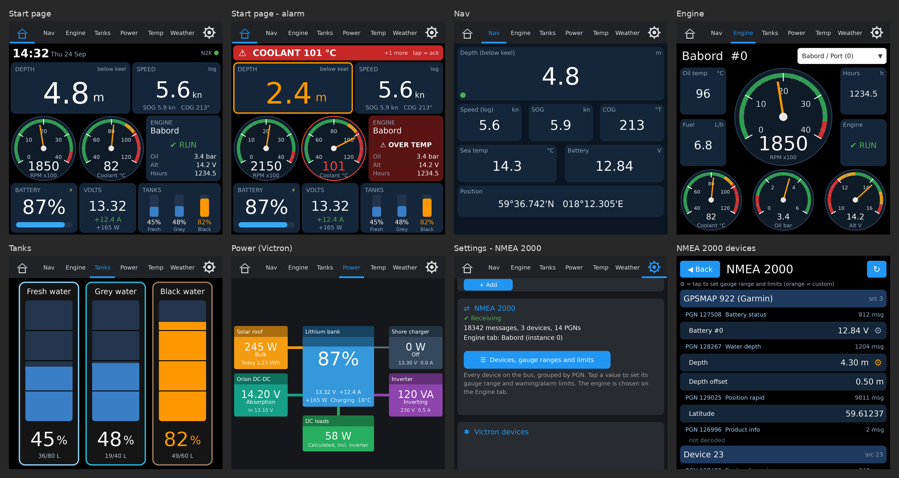
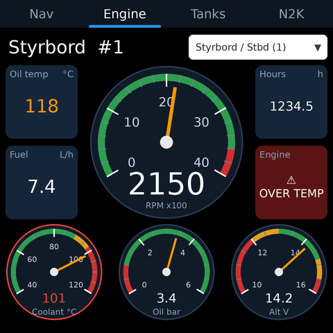
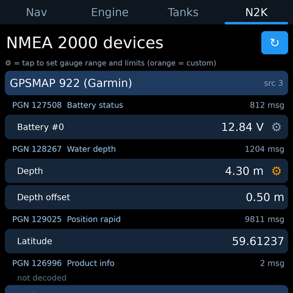
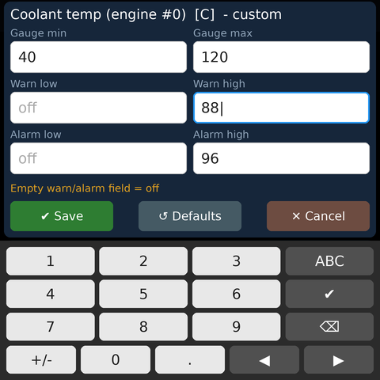

# esp32-S3-ws4-boat

Touch display firmware for a boat, running on the Waveshare **ESP32-S3-Touch-LCD-4 (V4)**
(480×480, capacitive touch, on-board CAN and RS485).

It shows **NMEA 2000** data from the boat's backbone (depth, speed, sea temperature,
position, engine data, tank levels) together with **Victron** and **RuuviTag** Bluetooth
sensors and **weather**, with logging to an **SD card**.

The project is a derivative of
[esp32-S3-ws4-caravan](https://github.com/fredrikrudin/esp32-S3-ws4-caravan); the
Victron, Ruuvi, weather and SD parts come from there. This repo adds NMEA 2000 support
and boat-specific screens.

> **Status: work in progress.** The NMEA 2000 modules and screens are written but not
> yet built and tested on hardware. The screenshots below are mockups rendered from
> the layouts, not photos of the device.



## Features

### NMEA 2000
- Receives N2K over the board's own CAN transceiver - no extra hardware
- **Listen-only by default**: never transmits PGNs or claims an address on the bus
- Generic data store: every value is stored by quantity + N2K instance, so new
  sensors show up without code changes
- Tanks (PGN 127505) are discovered automatically: fresh, grey and black water, fuel ...
- **Device and PGN browser** (N2K tab): every device on the bus, the PGNs it sends
  and the decoded values - handy to see what the chartplotter actually sends
- **Gauge ranges and warn/alarm limits editable per value** on the touch screen or
  via the web API, stored on the board

| PGN | Data |
|---|---|
| 127488 | Engine RPM |
| 127489 | Oil pressure, oil temp, coolant temp, alternator V, fuel rate, engine hours, engine alarms |
| 127505 | Tank levels (%) and capacity (L) |
| 127508 | Battery voltage and current |
| 128259 | Speed through water |
| 128267 | Depth and transducer offset |
| 129025 | Position |
| 129026 | COG / SOG |
| 130310, 130311, 130312, 130316 | Sea water temperature (and other temperatures) |

On the author's boat the data comes from a Garmin 922 chartplotter (depth, speed, sea temperature, volts, GPS).

### Screens

| Tab | Content |
|---|---|
| **Nav** | Depth (with transducer offset), log speed, SOG, COG, sea temperature, battery volts, position |
| **Engine** | Tachometer, coolant / oil pressure / alternator gauges with coloured zones, oil temp, fuel rate, hours, engine status and alarms |
| **Tanks** | One vertical gauge per tank in %, litres when the sender reports capacity |
| **N2K** | Devices → PGNs → values; tap a value to set its gauge range and limits |

<p>


</p>
<p>



</p>

### Twin engines
Each display shows one engine. Choose it in the Engine tab dropdown:
**Babord / Port (instance 0)**, **Styrbord / Stbd (instance 1)**, or a single engine.
For a twin-engine boat, mount two displays and set one to each engine. If both engine
gateways report instance 0, filter by source address (web API `engine_source`).

### Other
- Screensaver is blocked while the Engine tab is shown (configurable)
- Victron and RuuviTag BLE sensors, weather and SD logging from the caravan project;
  N2K values can be added to the SD log with `n2kCsvHeader()` / `n2kCsvLine()`
- JSON web API with all N2K data grouped by device and PGN

## Hardware

| | |
|---|---|
| Board | Waveshare ESP32-S3-Touch-LCD-4 V4 (480×480) |
| CAN pins | TX = GPIO6, RX = GPIO0 (from Waveshare's CAN demo - verify against the V4 schematic) |
| Connection | NET-H → CAN-H, NET-L → CAN-L, common ground with the boat 12 V system |

- Do **not** enable the board's 120 Ω CAN termination - an N2K backbone is already
  terminated at both ends.
- The CAN controller runs in normal (ACK) mode even in listen-only, so the display also
  works on a small test bus with just one other device.

## Building

Arduino IDE 2.x with the ESP32 core.

Libraries:
1. **NMEA2000** by Timo Lappalainen - Library Manager ("NMEA2000-library") or
   [GitHub](https://github.com/ttlappalainen/NMEA2000)
2. **NMEA2000_esp32_twai** by Sergei Podshivalov - ZIP from
   [GitHub](https://github.com/sergei/NMEA2000_esp32_twai)
   (the older `NMEA2000_esp32` does not build for the ESP32-S3)
3. **LVGL 8.x**, as used by the Waveshare demos. The gauges use `lv_meter`, which does
   not exist in LVGL 9. For larger numbers enable `LV_FONT_MONTSERRAT_48`, `_28`, `_20`
   and `_14` in `lv_conf.h`.
4. The libraries used by the caravan project (Victron, Ruuvi, weather, SD).

## Configuration

Board-specific settings and first-boot defaults are in **`n2k_config.h`**: CAN pins,
listen-only mode, default engine, tank list, and default gauge ranges and limits.

After first boot most things are set on the display:
- **Engine**: dropdown on the Engine tab
- **Gauge ranges and limits**: N2K tab → tap a value (orange ⚙ = changed from default)
- **Tank names, engine name and source filter**: web API

Built-in LVGL fonts have no å/ä/ö - keep display names ASCII unless a custom font is added.

## Web API

| Endpoint | Purpose |
|---|---|
| `GET /api/n2k` | All N2K data: devices → PGNs → values with limits, tanks, engine settings |
| `POST /api/n2k/set` | `key` + `value`: `engine_instance`, `engine_name`, `engine_source`, `tank_name`, `limits`, `limits_reset` |

Example - coolant limits for engine 0 (empty = off):
```
key=limits  value=eng_coolant_t,0,0,40,120,,,90,98
```

Details and integration notes: [N2K_INTEGRATION.md](N2K_INTEGRATION.md).

## Files

| File | Purpose |
|---|---|
| `n2k_config.h` | Pins, defaults, tank list |
| `n2k_bus.*` | CAN/TWAI setup and PGN decoding |
| `n2k_data.*` | Value store, PGN/device list, tank list |
| `n2k_limits.*` | Gauge ranges and warn/alarm limits (defaults + stored overrides) |
| `n2k_settings.*` | Engine selection and tank names |
| `n2k_web.cpp` | JSON, settings API, CSV helpers |
| `ui_n2k_common.*` | Shared tiles, fonts, colours |
| `ui_gauge.*` | Analog gauge widget |
| `ui_nav.*`, `ui_engine.*`, `ui_tanks.*`, `ui_n2k_settings.*` | The tabs |

## Roadmap

- [ ] Merge with the caravan code base and build on hardware
- [ ] Verify CAN pins and decoding against the Garmin 922
- [ ] Web page for limits, tank names and engine settings
- [ ] Support for the Waveshare ESP32-S3-Touch-LCD-5 (800×480 / 1024×600, CAN on GPIO15/16,
      7-36 V supply) with wide layouts, e.g. both engines on one screen

## Credits

- [NMEA2000](https://github.com/ttlappalainen/NMEA2000) by Timo Lappalainen
- [NMEA2000_esp32_twai](https://github.com/sergei/NMEA2000_esp32_twai) by Sergei Podshivalov
- Engine screen inspired by [Marine-Displays](https://github.com/Boatingwiththebaileys/Marine-Displays)
  by Boating with the Baileys
