<!-- esp32-S3-ws4-boat v1.0 -->
# esp32-S3-ws4-boat

**Version 1.0** - the first release. What changed in each version is in [CHANGELOG.md](CHANGELOG.md).

[](LICENSE.md) Free for non-commercial use - see [License](#license). Written with the help of Claude (Anthropic's AI).

See **[BOARD_NOTES.md](BOARD_NOTES.md)** for hard-won notes about this board: SD card wiring, memory limits, LVGL 8 pitfalls and the BLE protocols used here.

Boat display for the **Waveshare ESP32-S3-Touch-LCD-4 (V4)**, the 480×480 touch board with
the CH32V003 IO expander and an on-board CAN transceiver. Built with Arduino and LVGL 8.

It shows **NMEA 2000** data from the boat's backbone (depth, speed, sea temperature, position,
engine, tanks) together with **Victron** and **RuuviTag** Bluetooth sensors and **weather**,
and logs to an **SD card**. The display speaks **English or Swedish**.

Derived from [esp32-S3-ws4-caravan](https://github.com/fredrikrudin/esp32-S3-ws4-caravan) and
kept in step with it: the language setting, Ruuvi history, settings pages, alarms, power saving,
debug switch and logging are the same code. The relay board, Shelly and battery-BMS parts were
left out, NMEA 2000 was added.

> **NMEA 2000 is not yet tested on the boat.** The screens below are rendered by the
> firmware's own UI code on a PC with example data (see `tools/screenshots`), not photos.

## Screens

| | | |
|---|---|---|
| 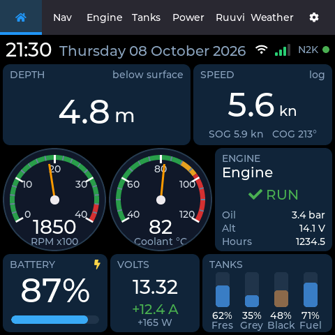 | 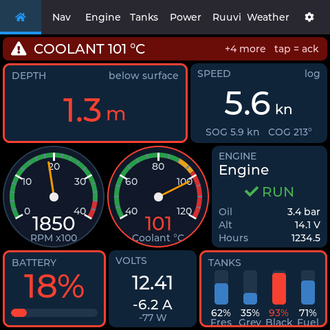 | 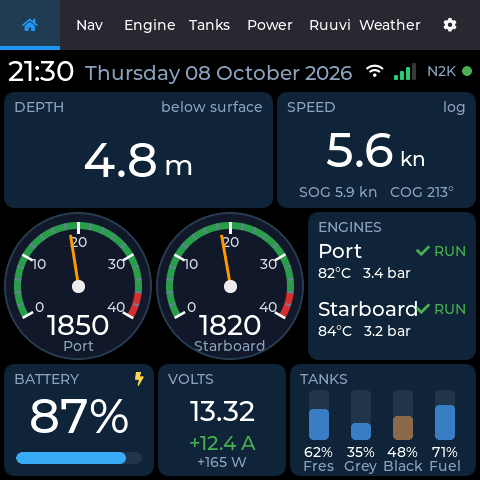 |
| Start page | An alarm: banner, outlines, colours | Twin engines |
| 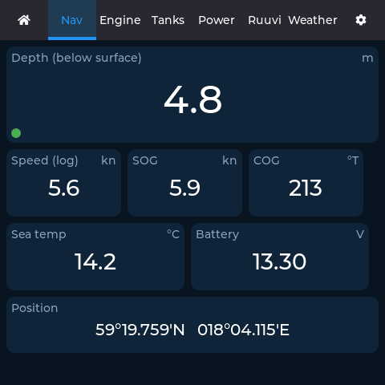 | 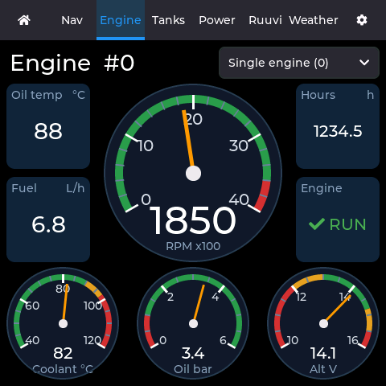 | 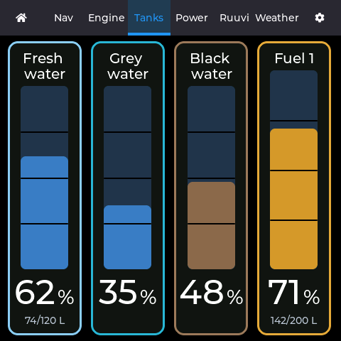 |
| Nav | Engine | Tanks |
| 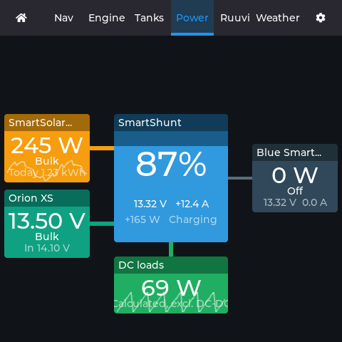 | 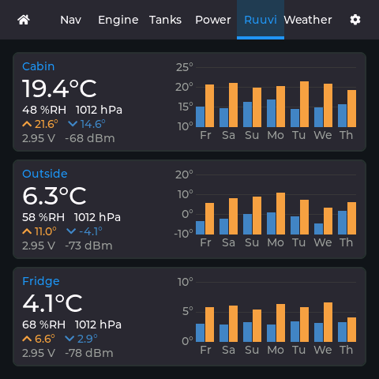 | 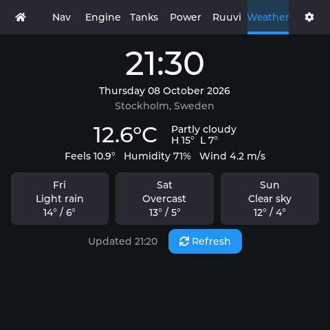 |
| Power (Victron) | Ruuvi, with 7 days per tag | Weather, with Refresh |
| 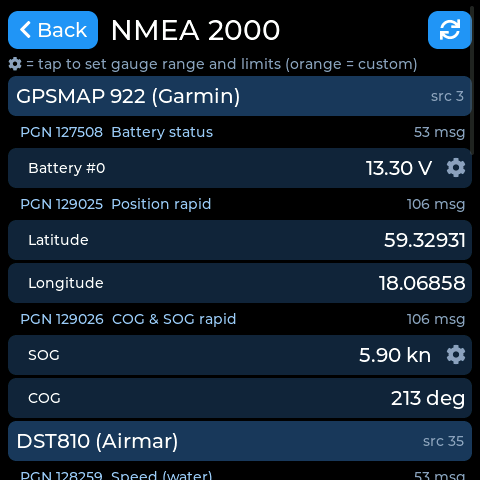 | 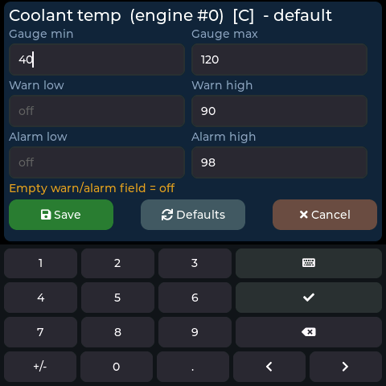 |  |
| NMEA 2000 devices and values | Gauge range and limits | Energy history |
| 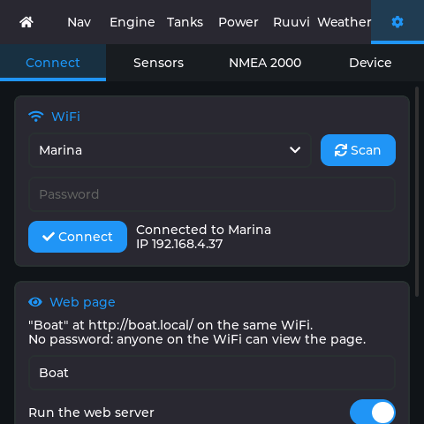 | 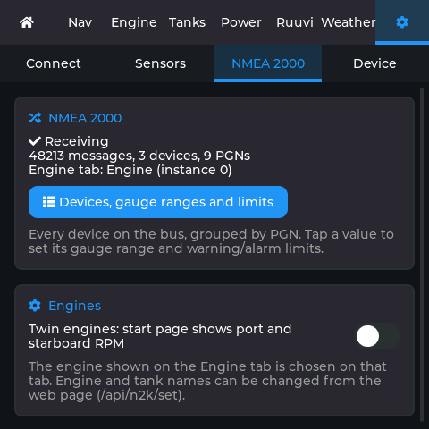 | 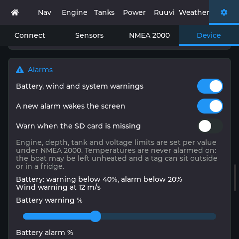 |
| Settings → Connect | Settings → NMEA 2000 | Settings → Device → Alarms |
| 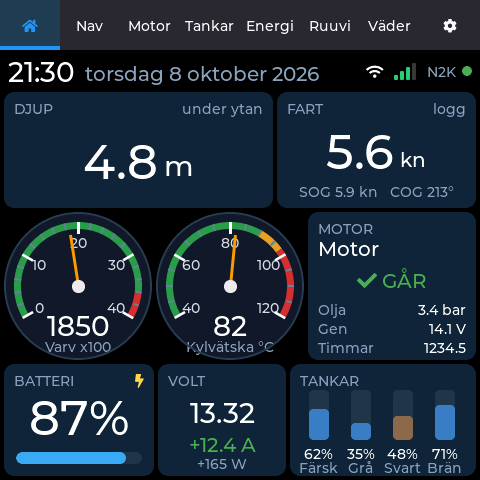 | 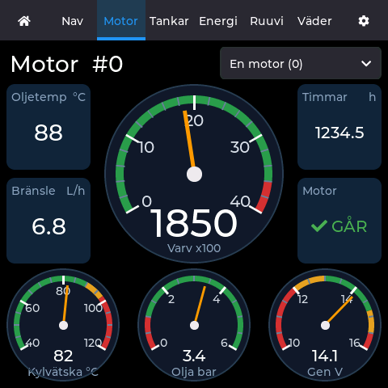 | 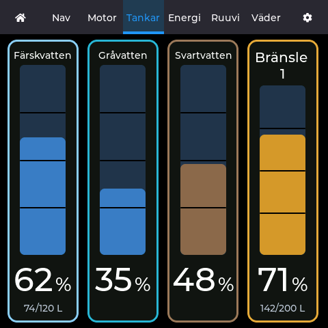 |
| Start page in Swedish | Engine in Swedish | Tanks in Swedish |

## Tabs

| Tab | What it shows |
|---|---|
| **⌂ Home** | [Start page](#start-page): time and date, WiFi signal, NMEA 2000 status, depth and speed, RPM and coolant (or port and starboard RPM with twin engines), engine status, battery SOC and volts, tanks. Warnings and alarms take over the top line |
| **Nav** | Depth (with transducer offset), log speed, SOG, COG, sea temperature, battery volts, position - NMEA 2000 |
| **Engine** | Tachometer, coolant / oil pressure / alternator gauges with coloured zones, oil temp, fuel rate, hours, engine alarms - NMEA 2000. The dropdown chooses which engine this display shows |
| **Tanks** | One vertical gauge per tank (fresh, grey, black water, fuel ...) in %, litres when the sender reports capacity - NMEA 2000 |
| **Power** | Victron devices over Bluetooth (Instant Readout) with animated energy flows; tap a tile for 24 h / 7 day history |
| **Ruuvi** | Up to 3 named RuuviTags: temperature, humidity, pressure, battery, and a chart of each tag's daily low and high over the last 7 days |
| **Weather** | NTP clock, current weather and a 3-day forecast from Open-Meteo (no API key). Updated every hour while the screen is awake, and at once with **Refresh** |
| **⚙ Settings** | Four pages: Connect, Sensors, NMEA 2000, Device - see [Settings](#settings) |

**Settings → NMEA 2000 → Devices, gauge ranges and limits** opens a list of every device on
the bus, grouped by the PGNs it sends, with the decoded values. Tap a value to set its gauge
range and warning/alarm limits. They are used by all tabs and the web page right away.

Tabs that are not on screen are not redrawn, which saves most of the CPU time.

## Start page

| Area | Content |
|---|---|
| Top line | Time and date, the WiFi symbol with signal bars, and an "N2K" dot (green while NMEA 2000 data arrives). Becomes the alarm banner |
| Depth | Large, with the sounder's offset applied; says whether it is below keel, surface or transducer |
| Speed | Speed through water (log); speed over ground and course underneath. Without a log: SOG |
| Middle | RPM and coolant dials + engine card (name, RUN / STOP / fault, oil pressure, alternator, hours) |
| Battery | State of charge with bar and a charging symbol (Victron battery monitor) |
| Volts | Battery voltage with current and watts (Victron, or the NMEA 2000 battery status when there is no Victron) |
| Tanks | The first four tanks as small bars in %, coloured by their limits |

### Warnings and alarms

Every value with limits (depth, RPM, coolant, oil pressure, alternator, battery volts, tanks)
and the engine's own fault flags are checked twice a second. The banner also shows the
general warnings: battery state of charge, a Victron device with a wrong key or gone quiet,
an inverter alarm, the battery running empty, strong wind, WiFi lost, the board's own battery
and the SD card.

- The top line becomes a banner with the most important message: **orange** for a warning,
  **red and blinking** for an alarm, "+N more" when there are several.
- The card of that value gets an orange or red outline and its value changes colour; an
  engine fault turns the whole engine card red.
- A new alarm wakes the screen saver, keeps the screen on, switches to the start page (not
  when the Engine tab is shown, which displays it too) and is written to the log.
- Tap the banner to acknowledge: it stops blinking and the screen may sleep again, but it
  stays until the value is back in range.
- Tank levels only reach the banner at alarm level; tank warnings just colour the tank.
- Low oil pressure and low alternator voltage only count while the engine runs.

The NMEA 2000 limits are set per value under **Settings → NMEA 2000 → Devices, gauge ranges
and limits**. **Settings → Device → Alarms** has the battery warning and alarm levels, the wind
warning, the SD card warning, a switch for the general warnings and the switch for **a new alarm
wakes the screen**. The web page lists the general warnings at the top. The number of tanks on
the start page is `START_TANKS` at the top of `ui_home.cpp`.

### Twin engines

**Settings → NMEA 2000 → Engines → Twin engines** switches the start page to two RPM dials:

- **Port** (N2K engine instance 0) on the left, **Starboard** (instance 1) on the right, with
  the engine's name on each dial. Each dial uses its own engine's limits.
- The coolant dial is hidden. The engine card becomes **ENGINES** with a block per engine:
  name and RUN / STOP / FAULT, then coolant temperature and oil pressure, coloured by their
  limits.
- Alarms carry the engine name, e.g. "PORT COOLANT 101 °C" ("BABORD KYLVÄTSKA 101 °C" in Swedish);
  a fault on either engine turns the card red.
- The names are "Port" and "Starboard", shown as "Babord" and "Styrbord" in Swedish. Change
  them with the web API keys `port_name` / `stbd_name`; `twin_engines` = 0/1 switches the mode.
  The instances are `ENG_PORT_INSTANCE` / `ENG_STBD_INSTANCE` in `n2k_config.h`.
- The setting and the names are included in the settings backup.

The **Engine tab** always shows one engine in detail: a single engine, **Port (instance 0)**,
**Starboard (instance 1)** or instance 2 or 3, chosen in its dropdown. With two displays, set
one to each engine. See [N2K_INTEGRATION.md](N2K_INTEGRATION.md) if both engine gateways report
instance 0.

## Settings

Settings has its own row of tabs, so no page is more than a couple of screens long.
Each page is a column of cards.

| Page | Cards |
|---|---|
| **Connect** | **WiFi** (scan, password, status) &middot; **Web page** (run the server, name, password) &middot; **Weather location** |
| **Sensors** | **Temperature** (up to 3 RuuviTags) &middot; **Victron devices** (add, name, encryption key, live status) &middot; **Sensor scan interval** |
| **NMEA 2000** | **NMEA 2000** (bus status, devices, gauge ranges and limits) &middot; **Engines** (twin engines) |
| **Device** | **Language** (English, Svenska) &middot; **Display** (brightness, screen saver brightness) &middot; **SD card** (mount, eject, probe, logs, CSV, backup) &middot; **Power** (CPU slowdown, onboard LiPo, battery mode and its shutdown threshold) &middot; **Starting screen** &middot; **Alarms** &middot; **Debug** (serial monitor, performance log) &middot; **About** &middot; **System** (restart, shut down, full reset) |

Temperature has an on/off switch: switching it off also stops the RuuviTag decoding and takes
the Ruuvi tab off the tab bar. A **full reset** erases every setting, the NMEA 2000 engine
choice, tank names and limits included, so back up to the card first.

**Starting screen**: a name in large letters ("BOAT" by default, "BÅT" in Swedish) while the
board starts, in the size, colour and for the number of seconds you choose (0 skips it).

**Running on the onboard battery**: with a LiPo in the board's connector and "Keep running on
the battery" switched on under Settings → Device → Power, losing external power turns the
display into a local instrument: WiFi and Bluetooth off, screen at 10%, CPU at 80 MHz. At the
threshold you set (20% by default) it closes the log, unmounts the card and sleeps.

**Screen saver**: after 30 s without touch, a 96-pixel clock and the battery state of charge
on a dimmed screen - **except while the Engine tab is shown or an alarm is not yet
acknowledged** (`ENG_KEEP_AWAKE` in `n2k_config.h`). A tap wakes it. The weather is not fetched
while it shows.

## Language

The display speaks **English** (the default) or **Swedish**, chosen under Settings → Device →
Language. Changing it restarts the board, which takes a few seconds. Both are built into the
firmware, so no SD card is needed. Engine and tank names that are still the defaults are
translated too ("Port" becomes "Babord", "Fresh water" becomes "Färskvatten"); names you set
yourself are shown as typed. The web page and its JSON stay in English.

Translations are ordinary gettext `.po` files in `lang/`, so they can be edited with
[Poedit](https://poedit.net/), and new languages can be added the same way. See
[`lang/README.md`](lang/README.md).

## Web page

Open **`http://boat.local/`** (or the board's IP, shown under Settings → WiFi) on the same
WiFi. It shows the warnings, the battery and solar gauges, temperatures, depth, speed, sea
temperature, engine and tanks, charts of the last 24 hours, the weather, the Victron devices
and the board battery, and refreshes every 5 seconds. It is read-only.

| Path | |
|---|---|
| `/json` | Summary as JSON (battery, Victron, alarms, temperatures, board battery, weather, boat) |
| `/api/n2k` | All NMEA 2000 data: devices → PGNs → values with limits |
| `/api/n2k/set` | POST: engine, tank names, gauge ranges and limits (see [N2K_INTEGRATION.md](N2K_INTEGRATION.md)) |
| `/log` | Recent log lines |
| `/files` | Files on the SD card, for download |

Under **Settings → Connect → Web page** you can switch the server off (which frees its memory),
name the page and set a password; scripts can then use `?key=<password>`. The page uses plain
HTTP, so the password keeps casual visitors out but is not strong security.

## Getting started

1. Install the libraries and set the Arduino IDE options below.
2. Open `esp32-S3-ws4-boat.ino` and upload.
3. On the board, open **⚙ Settings**: WiFi, weather location, RuuviTags, Victron devices
   (name + 32-character encryption key from VictronConnect → Product info), and the language.
4. Connect the CAN terminal to the NMEA 2000 backbone (see Hardware notes) and check
   **Settings → NMEA 2000**: it should say *Receiving* and list your devices.
5. Choose the engine on the Engine tab.

Tip: `tools/n2k_bus_test/n2k_bus_test.ino` is a standalone sketch (no display) that prints
every PGN and decoded value to the Serial Monitor - useful for a first wiring test. Open it as
a sketch of its own: it is in its own folder so the Arduino IDE does not build it together
with the display firmware.

## Libraries

- **lvgl 8.x**, with the `lv_conf.h` from Waveshare's examples (the gauges use `lv_meter`,
  which LVGL 9 no longer has); `lv_conf.example.h` shows the settings that matter
- **GFX Library for Arduino**, **SensorLib** and **WS_CH32_IO**: the versions bundled with
  Waveshare's ESP32-S3-Touch-LCD-4 examples
  ([waveshareteam/ESP32-S3-Touch-LCD-4](https://github.com/waveshareteam/ESP32-S3-Touch-LCD-4), `examples/arduino/libraries`)
- **ArduinoJson** v7
- **NimBLE-Arduino** by h2zero, v2.x
- **NMEA2000** by Timo Lappalainen ([GitHub](https://github.com/ttlappalainen/NMEA2000), Library Manager: "NMEA2000-library")
- **NMEA2000_esp32_twai** by Sergei Podshivalov ([GitHub](https://github.com/sergei/NMEA2000_esp32_twai), install as ZIP;
  the older `NMEA2000_esp32` does not build for the ESP32-S3)

## Arduino IDE settings

- Board: ESP32S3 Dev Module
- **PSRAM: OPI PSRAM** (display framebuffer and LVGL buffers live there)
- **Erase All Flash Before Sketch Upload: Disabled**, otherwise every upload wipes the saved settings

In `lv_conf.h`:

- Enable `LV_FONT_MONTSERRAT_14`, `_16`, `_20`, `_28`, `_32` and `_48` for the gauges, the big
  clock and temperatures (missing sizes fall back to smaller fonts). The Swedish letters come
  from `font_latin1.c`, which adds them to these sizes.
- `LV_USE_METER 1` (default in LVGL 8)
- To free internal RAM, move LVGL's memory pool to PSRAM:
  ```c
  #define LV_MEM_POOL_INCLUDE <esp32-hal-psram.h>
  #define LV_MEM_POOL_ALLOC ps_malloc
  ```

## Version numbers

The version is `FW_VERSION` in `app.h`. It is shown under Settings → Device → About, on the
web page and in the first log line, and every file carries it on its first line as a comment
(`// esp32-S3-ws4-boat v1.0`). To change it everywhere at once:

```
python3 tools/set_version.py 1.1
```

Run it without a number after adding a file, to tag the new file with the current version.
Every change gets an entry in [CHANGELOG.md](CHANGELOG.md).

## Logging

Everything the firmware logs goes to a 24 kB buffer in PSRAM that you can read in a browser
at `/log` without attaching a computer, and to the TF card when that is switched on.

**USB serial (Arduino's Serial Monitor, 115200):** off by default, and then only faults are
written there: errors and warnings, such as an SD card that can't be found, a lost WiFi
connection, the CAN bus failing to open, a new alarm, low memory or a battery shutdown. Switch on
**Settings → Device → Debug → Serial monitor** to see everything as well. The switch is saved
and read first thing at start-up, so the boot lines follow it too. `N2K_DEBUG_SERIAL` in
`n2k_config.h` adds every NMEA 2000 value or message, also only with the serial monitor on.
**Log memory, CPU and battery** in the same section writes a status line every few seconds.

**SD card:** switch on **Settings → Device → SD card** to also append everything to `/boat.log`
on the TF card (SPI: GPIO2 clock, GPIO1 MOSI, GPIO4 MISO). Files can be downloaded at `/files`.

**Measurements as CSV:** "Log measurements" appends a line to `/data.csv` every 1, 5, 15 or
60 minutes: time, SOC, battery, solar, RuuviTag and outside temperatures, then the NMEA 2000
values (depth, speed, SOG, COG, sea temp, position, engine and tank levels).

**Settings backup:** "Back up settings" writes everything to `/settings.json`, including WiFi,
Victron keys, alarms, the starting screen, the language and the NMEA 2000 engine choice, tank
names and limits. "Restore" reads it back and restarts.

## Configuration

`n2k_config.h`: CAN pins, listen-only mode, default engine, tank list, first-boot gauge ranges
and limits, screensaver behaviour on the Engine tab. `app.h`: web page name (`MDNS_NAME`),
screen saver timeout and the other general settings.

## Files

Flat folder: `app.h` holds shared configuration, types and declarations; each `.cpp` is one module.

| File | Contents |
|---|---|
| `esp32-S3-ws4-boat.ino` | `setup()` and `loop()` |
| `app.h`, `state.cpp` | Shared declarations, state, settings loading |
| `board.cpp` | Display, touch, IO expander, LVGL driver, backlight, onboard LiPo |
| `net.cpp` | Network task: WiFi, NTP, weather, all flash writes |
| `web.cpp` | Web page, `/json`, `/api/n2k` |
| `ble.cpp`, `ruuvi.cpp`, `victron.cpp` | Bluetooth scanning, RuuviTag and Victron decoding |
| `ruuvi_hist.cpp` | Daily low and high per RuuviTag, 7 days, kept in flash |
| `alarms.cpp` | Battery, Victron, wind, WiFi, LiPo and SD card warnings |
| `power.cpp`, `sw6106.cpp` | Power saving, battery mode, performance log; power bank keep-alive |
| `sdlog.cpp`, `datalog.cpp` | Log, CSV measurements, settings backup |
| `history.cpp`, `ui_history.cpp` | Energy history behind the Power tab |
| `lang.cpp`, `lang_tables.h`, `lang/`, `font_latin1.c` | Language: translation lookup, the built-in translations (generated), the `.po` files, fonts with Swedish letters |
| `n2k_config.h` | NMEA 2000 configuration |
| `n2k_bus.*`, `n2k_data.*`, `n2k_limits.*`, `n2k_settings.*`, `n2k_web.cpp` | NMEA 2000: CAN, value store, limits, settings, JSON |
| `ui_common.cpp` | Tabs, keyboard, widget helpers, starting screen, timers |
| `ui_home.cpp` | Start page, warnings and alarms, twin-engine layout |
| `ui_power.cpp`, `ui_temp.cpp`, `ui_weather.cpp` | Power, Ruuvi and Weather tabs |
| `ui_nav.*`, `ui_engine.*`, `ui_tanks.*` | Nav, Engine and Tanks tabs |
| `ui_n2k_settings.*` | NMEA 2000 device/PGN browser and limit editor |
| `ui_gauge.*`, `ui_n2k_common.*` | Analog gauge widget, shared tiles, colours and fonts |
| `ui_settings.cpp`, `ui_victron_settings.cpp` | Settings tab |
| `ui_saver.cpp`, `font_clock_96.c` | Screen saver and its 96 px clock font |
| `N2K_INTEGRATION.md` | How the NMEA 2000 part works, web API, limits |
| `memory.md` | Notes on internal RAM use |
| `tools/set_version.py` | Sets the version in every file |
| `tools/i18n.py`, `tools/strings.py` | Translations: template, `.po` update, `lang_tables.h` |
| `tools/screenshots/` | Renders the screenshots with the real UI code on a PC |
| `tools/n2k_bus_test/` | Standalone NMEA 2000 bus test sketch |

## Hardware notes

- **TF card**: on the V4 board the slot works over **SPI** (SCK GPIO2, MOSI GPIO1, MISO GPIO4), with chip select handled on the board. Waveshare's own `10_LVGL_SD` example uses SD_MMC and does not work on this revision (error `0x107`, `send_op_cond` timeout). Settings → SD card → **Probe card** tries both bus modes, both expander direction values and every bit, and logs what works. If the card stops mounting after a software restart, a power cycle brings it back.
- **CAN / NMEA 2000:** TX = GPIO6, RX = GPIO0 (Waveshare V4.0 hardware reference).
  NET-H → CAN-H, NET-L → CAN-L, common ground with the boat's 12 V. Do **not** switch on the
  board's 120 Ω termination: an N2K backbone is already terminated. The display only listens
  by default (`N2K_LISTEN_ONLY`).
- **Backlight** PWM comes from the CH32V003 and is inverted (0 = full, 255 = off); handled in `set_backlight()`.
- **I2C** (touch, CH32V003, RTC) is on GPIO15/7.
- **Victron:** enable *Instant readout via Bluetooth* in VictronConnect and copy the encryption key from *Product info*.
- **Weather** uses plain HTTP: HTTPS needs more internal RAM than is free with WiFi, Bluetooth and the display running.

## Troubleshooting

| Problem | Likely cause |
|---|---|
| Settings gone after an upload | *Erase All Flash Before Sketch Upload* is enabled |
| Settings → NMEA 2000 says "No NMEA 2000 data" | Wiring (CAN-H/L swapped?), no N2K power on the backbone, or ground missing |
| A device's name shows as "Device 23" | It announced itself before the display started; restart the device, or set `N2K_LISTEN_ONLY false` |
| Engine tab stays empty | Wrong instance chosen, or both gateways use instance 0 (use `engine_source`) |
| Weather or city lookup fails | Switch on the serial monitor (Settings → Device → Debug) and look for the `HTTP` and `Internal heap` lines |
| Victron "Wrong key" / "No signal" | Key mistyped / out of range or Instant readout off |
| Boxes instead of letters | Å, Ä, Ö show only while a language other than English is chosen |

## Credits

- [NMEA2000](https://github.com/ttlappalainen/NMEA2000) by Timo Lappalainen
- [NMEA2000_esp32_twai](https://github.com/sergei/NMEA2000_esp32_twai) by Sergei Podshivalov
- Engine screen inspired by [Marine-Displays](https://github.com/Boatingwiththebaileys/Marine-Displays)

## License

Copyright (c) 2026 Fredrik Rudin. Licensed under
[Creative Commons Attribution-NonCommercial 4.0 International (CC BY-NC 4.0)](https://creativecommons.org/licenses/by-nc/4.0/):
you may use, share and change it for non-commercial purposes, with credit to the author.
Selling it, or devices running it, needs the author's permission. Details and the
third-party licenses are in [LICENSE.md](LICENSE.md).

This code was written with the help of **Claude**, an AI model by
[Anthropic](https://www.anthropic.com), under the author's direction.
